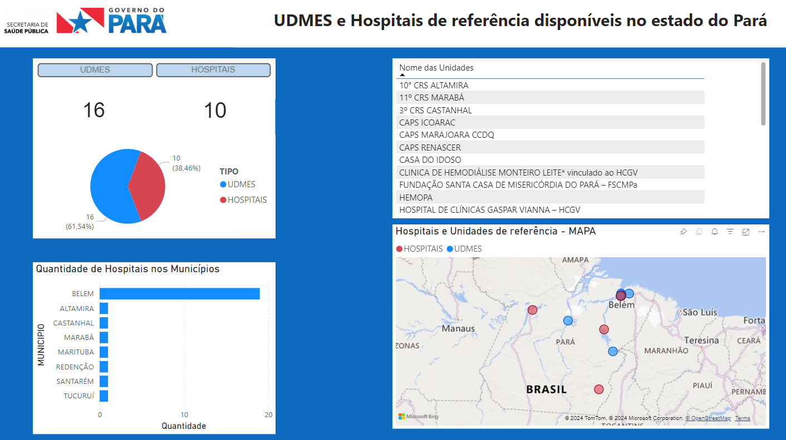
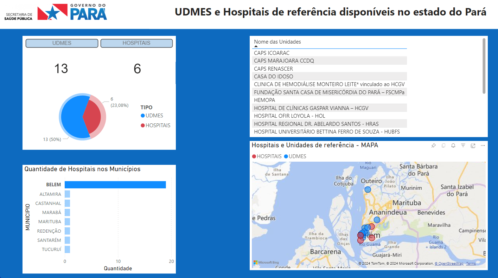

# Processo de ETL

## Atualizando dados com API de geocodificação

 
[ Desafio de Projeto - (Avançado)](https://web.dio.me/lab/explorando-ia-generativa-em-um-pipeline-de-etl-com-python/learning/63d1d743-0d7d-411b-82a6-625348c85054)

O desafio pedia para reimaginar um processo de ETL, não era obrigatório utilização de APIs externas, porém neste projeto foi necessário para obter os endereços e coordenadas dos hospitais.

## 🏥🚑 UDMES e Hospitais de Referência - SESPA

Os dados estão disponíveis no site da [Secretaria de Estado da Saúde do Pará (SESPA)](http://www.saude.pa.gov.br/).
A planilha foi editada para conter apenas os dados relevantes para o estudo, então atributos como telefone do local e e-mails do responsável foram retirados. Assim, a planilha utilizada para o projeto contêm o munincípio, o nome do estabelecimento e o CEP.

❗ O motivo de utilizar a API para geolocalização provém do motivo que apesar de existir bibliotecas como <i>geopy</i>, <i>pycep</i> e <i>pycep-correios</i>, essas possuíam contras:

 - Não continham boa precisão;
 - Apenas 5% dos CEPs fornecidos eram reconhecidos;
 - Não ofereciam valores das coordenadas.

✔ Dessa forma, optou-se por usar a [Brasil API](https://brasilapi.com.br/docs) como solução. Propriamente a [Versão 2 de CEP](https://brasilapi.com.br/docs#tag/CEP-V2) pois retorna as coordenadas. Apesar dela ter maior precisão que as bibliotecas é informado que a geolocalização dos CEPs estão suscetíveis a erros, pois as coordenadas são provindas do OpenStreetMap, então caso o CEP não esteja no banco de dados não irá retornar nada. 

A OSM é bem precisa e possui armazenamento provindo de diversos serviços como correios, viacep, midway, entre outros. Então para ter <u>boa precisão</u> e ser <u>gratuito</u>, utilizou-se o Brasil API.

📑 Para finalizar, os novos atributos obtidos serão: endereço completo e as coordenadas. Esses serão adicionados ao <i>dataframe</i> e será elaborada uma nova planilha, agora com as informações do <u>Munincípio</u>, <u>Nome do Estabelecimento</u>, <u>CEP</u>, <u>Endereço Completo</u> e as <u>Coordenadas (Longitude e Latitude)</u>.

 

🔎 [Planilha](https://github.com/limasfernanda/APIGeocode/blob/main/saudepac.csv)  utilizada em formato CSV

🧱 [Relatório](https://github.com/limasfernanda/APIGeocode/blob/main/Hospitais_UDMES_saudePA.pbix)  .pbix

💻 [Código](https://github.com/limasfernanda/APIGeocode/blob/main/projetosaudePA.ipynb) realizado em  Jupyter para esse desafio.

## Resultado

Utilizando como ferramenta de visualização de dados o Microsoft Power BI, ao visualizar no mapa os pontos percebe-se que há uma concentração de unidades em Belém, porém uma falta de apoio no noroeste e sudoeste do Pará. A maioria das zonas e regiões onde têm unidades e hospitais ficam próximas de rios e afluentes. A região noroeste e sudoeste do Pará é onde ficam as terras indígenas, reservas e áreas de proteção.

 Figura 1 - Relatório dos pontos de Hospitais e UDMES de referência no Pará
    

 

 Figura 2 - Selecionando o Município apenas de Belém
    

